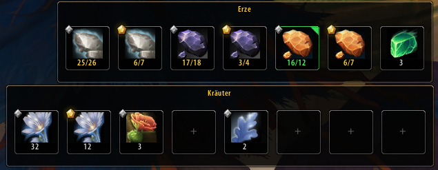
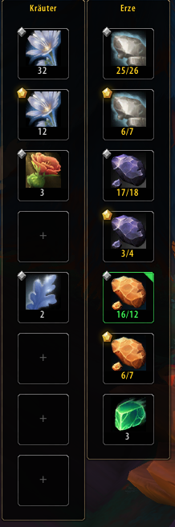
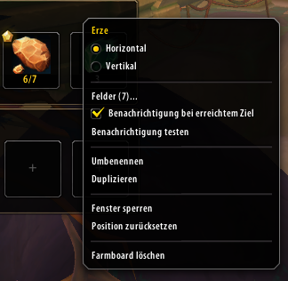
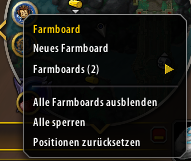

# Farmboard

**Farmboard** is a lightweight farming progress tracker for **World of Warcraft: Midnight**.

Create multiple customizable farming boards, drag items into tracking slots, set collection goals, and monitor your progress directly in-game.

## Features

- Multiple independent Farmboards
- Drag & drop item tracking
- Custom farming goals from **1 to 9999**
- Tracks bags, character bank and Warband/Account Bank
- Midnight crafting/reagent quality indicators
- **1–24 configurable slots** per board
- Horizontal and vertical layouts
- Movable and lockable boards
- Rename and duplicate boards
- Show, hide, reset and delete individual boards
- Minimap button with global board management
- Goal-complete marker, sound and centered **“- Ziel Erreicht! -”** notification
- Persistent settings via SavedVariables
- No external libraries required

## Screenshots

### Multiple Farmboards

Track multiple farming goals at once with independent horizontal Farmboards.

### Vertical Layout

Switch any Farmboard between horizontal and compact vertical layouts.

### Board Settings

Configure slots, goal notifications, names, duplication, locking and positioning for each Farmboard.

### Minimap Management

Create and manage your Farmboards quickly through the minimap button.

## How It Works

1. Drag an item from your bags onto a free Farmboard slot.
2. Right-click the occupied slot and enter your farming target.
3. Collect the item and watch your progress update automatically.
4. When the target is reached, Farmboard can play a sound and show a completion notification.

## Controls

- **Drag item onto a slot** — Add or replace an item
- **Right-click item slot** — Set the farming target
- **Shift + Right-click item slot** — Remove the item
- **Drag Farmboard** — Move the board while it is unlocked
- **Right-click Farmboard** — Open board-specific options
- **Left-click minimap button** — Show or hide all Farmboards
- **Right-click minimap button** — Open the global Farmboard menu
- **Drag minimap button** — Move the button around the minimap

## Slash Commands

- `/farmboard` or `/fb` — Show/hide all Farmboards
- `/fb new` — Create a new Farmboard
- `/fb show` — Show all Farmboards
- `/fb hide` — Hide all Farmboards
- `/fb reset` — Reset all Farmboard positions

## Installation

1. Download `Farmboard-v1.0.0.zip` from `dist/`.
2. Extract the `Farmboard` folder to:
   `World of Warcraft/_retail_/Interface/AddOns/`
3. Restart World of Warcraft or use `/reload`.

## Version

Current release: **1.0.0**

## Author

**Loyftwa**
